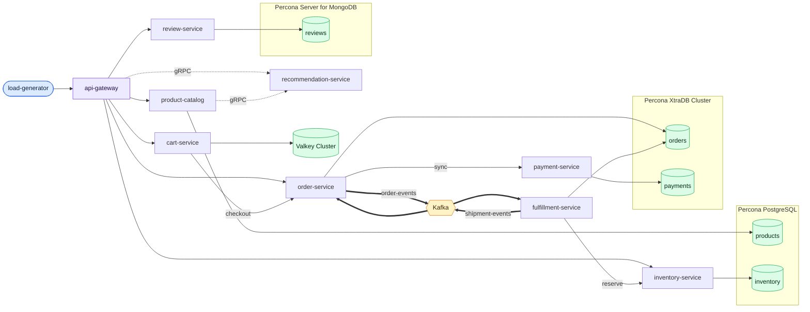
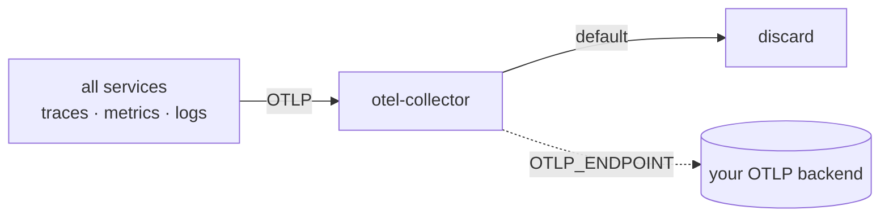

# rca-lab

A realistic, reproducible failure lab for evaluating root-cause-analysis (RCA)
tooling — human or AI — on a live Kubernetes cluster.

Most RCA benchmarks replay canned telemetry from toy environments with
synthetic faults toggled by feature flags. rca-lab takes the opposite approach:

- **A real polyglot microservice stack** (Python, Go, Java, Node.js, Rust, PHP)
  behind an API gateway, with continuous generated load.
- **Real databases under production-grade operators**: PostgreSQL, MySQL and
  MongoDB via Percona operators, a Valkey Cluster via the valkey-operator,
  Kafka via Strimzi — with
  seeded data volumes.
- **Real failure mechanisms only.** No chaos flags inside the apps. A GC
  pressure incident is a genuine allocation regression shipped as a new image
  version and rolled back later; a database incident is an analytics workload
  running heavy queries against the production database; a traffic spike is
  actually more traffic.
- **Durable revert.** Every failure scenario is a `FailureScenario` custom
  resource driven by an operator that restores the normal state when the
  scenario ends, is disabled, or is deleted — even across operator restarts.
- **Rich telemetry, bring your own backend.** Every service is instrumented
  with OpenTelemetry SDKs: traces, SDK-emitted metrics (JVM/runtime/HTTP), and
  logs (to stdout *and* OTLP, trace-correlated). Everything flows to a bundled
  otel-collector that **discards data by default** — point it at any OTLP
  backend with one variable.

## Quick start

Requirements: `kubectl` + `helm` pointed at a cluster (any distribution;
a default StorageClass, ~8 CPU / 16 GiB across nodes for the full-size lab).

```bash
git clone https://github.com/coroot/rca-lab && cd rca-lab
make deploy                 # everything: operators → databases → Kafka → apps → seed
```

Single-node cluster (kind/k3d/minikube):

```bash
make deploy SINGLE_NODE=1
```

Send telemetry somewhere (e.g. Coroot, or any OTLP endpoint):

```bash
make deploy OTLP_ENDPOINT=my-backend:4317
```

Other variables: `STORAGE_CLASS=<name>`, `SEED_SIZE_GB=<n>` (0 skips seeding),
`OTLP_HEADERS=k=v`, `YES=1` (no confirmation prompt). Re-running `make deploy`
converges idempotently — it is also how you change any of these settings.

Teardown:

```bash
make clean                  # KEEP_DATA=1 keeps the database volumes
```

## Triggering failures

Scenarios are Kubernetes custom resources:

```bash
kubectl get failurescenarios
kubectl patch failurescenario pg-analytics-queries --type=merge -p '{"spec":{"enabled":true}}'
```

or use the web UI:

```bash
kubectl port-forward svc/rca-lab-operator 8080
```

Each scenario documents its mechanism and the telemetry symptoms an RCA tool
should be able to observe. Scenarios can also run on a cron schedule with a
fixed duration — see `scenarios/`.

> **Never install rca-lab on a shared or production cluster.** The scenario
> operator deliberately has the power to degrade workloads in its namespace.

## Scenario library

Every scenario uses a genuine real-world mechanism — never a synthetic fault
flag inside the app — and reverts durably. Each carries an `expectedSymptoms`
list that doubles as documentation and a grading rubric for RCA tools.

| Scenario | Category | Mechanism | What an RCA tool should find |
|----------|----------|-----------|------------------------------|
| `pg-analytics-queries` | database | An `analytics-reporting` workload runs heavy multi-join/aggregation queries (full scans of the ~10 GB products table) against the production PostgreSQL, through the same pgBouncer pool as the apps. | Elevated `product-catalog`/`inventory-service` latency; PostgreSQL CPU/IO saturation; new full-scan query fingerprints in `pg_stat_statements` attributable to the `analytics-reporting` workload. |
| `pg-exclusive-lock` | database | A stalled `schema-migration` transaction takes a real `ACCESS EXCLUSIVE` lock on the `products` table (`LOCK TABLE`) and then hangs holding it — the "a migration grabbed the lock and never let go" incident. | product-catalog queries on `products` block on the lock; its connection pool fills and the service goes unavailable, so `api-gateway` product endpoints error — yet **PostgreSQL CPU/IO stay flat** because nothing is executing. The tell is lock waits (`pg_locks` / `pg_blocking_pids`), not resource saturation. |
| `mysql-analytics-queries` | database | The same `analytics-reporting` actor runs large join/aggregation queries (filesort, temp tables) against the production MySQL `orders` database via HAProxy. | Elevated `order-service`/checkout latency and errors; PXC CPU/IO saturation; heavy statements in the slow query log attributable to the workload. |
| `order-service-gc-regression` | deploy | A genuine bad deploy: `order-service` rolls out `1.1.0`, a real code regression that deep-copies every order read into an ineffective cache. GC pressure builds; revert rolls back to the known-good image. | p99 rises after the rollout while p50 stays flat; JVM allocation rate and GC time climb; heap sawtooth trends toward the limit; onset correlates exactly with the deployment event. |
| `traffic-spike` | infra | The `load-generator` Deployment is scaled to 5 replicas — real extra traffic across the whole stack. | Uniform RPS increase everywhere; saturation (latency/errors) appears only at the weakest component, testing cause-vs-consequence reasoning. |
| `order-service-memory-leak` | deploy | A genuine bad deploy: `order-service` rolls out `1.4.0`, a real regression that appends a batch of small "audit trail" objects per read into a registry that is never pruned. Slow leak of millions of tiny objects; revert rolls back to the known-good image. | p95/p99 creep up *gradually* (no crash, no step change); old-gen/live-set trends up; GC time and mixed-collection frequency rise as the live set grows; onset matches the rollout. Distinct from the fast OOM-crash leaks. |
| `product-catalog-gc-pressure` | deploy | A genuine bad deploy: `product-catalog` rolls out `1.1.0`, whose server-side "product cards" re-encode every returned product into large short-lived buffers on each read. Nothing retained (no leak) — pure allocation churn; revert rolls back. | Go GC CPU fraction and cycle frequency spike; allocation rate jumps while heap in-use stays bounded (no OOM); `product-catalog` CPU saturates/throttles and latency rises, propagating to `api-gateway`; Postgres stays healthy. |
| `review-service-event-loop` | deploy | A genuine bad deploy: `review-service` rolls out `1.1.0`, adding a synchronous "content safety" CPU loop on the request path that blocks the single-threaded Node.js event loop for tens of ms per read. Revert rolls back. | p95/p99 balloon at flat RPS; event-loop lag spikes and one CPU core pegs; latency grows with concurrency (requests serialize), not with DB time; MongoDB stays healthy — the bottleneck is in-process CPU, not the database. |
| `recommendation-memory-leak` | deploy | A genuine bad deploy: `recommendation-service` rolls out `1.1.0`, a real Go regression that retains a ~256 KB profile per gRPC call in an unbounded map. Revert rolls back to the known-good image. | RSS/Go heap climb steadily to the memory limit → OOMKill (exit 137) → restart sawtooth; `product-catalog`/`api-gateway` see recommendation gRPC errors during restarts; onset matches the rollout. |
| `cpu-noisy-neighbor` | infra | A batch `video-transcoder` workload is co-located (pod affinity) onto the nodes running `order-service` and burns all their cores. | Node CPU saturates (~100%); the Burstable `order-service` is starved far below its normal CPU; its dependencies (MySQL, Kafka) stay healthy — the cause is node-local CPU contention from a co-tenant, not the victim. |
| `dns-slow-resolution` | network | Chaos Mesh delays the app tier's packets to the cluster DNS service (~500 ms) — a real network condition on the DNS path, not fabricated answers — so every name lookup is slow. | Services show intermittent p95/p99 spikes on *all* outbound calls (each new connection front-loads a slow lookup), while every dependency **and CoreDNS itself** stay healthy (flat CPU). The tell is DNS query latency, not any one hop — the classic "it's always DNS." |
| `network-delay-product-catalog` | network | Chaos Mesh injects ~200 ms of egress latency on `product-catalog` (a `NetworkChaos` fault with a dead-man `spec.duration`). | `api-gateway` latency for catalog-backed endpoints jumps to ~1 s while `product-catalog`'s own CPU/DB stay healthy; the delay is on the network path, not in the service or PostgreSQL. |

More scenarios (bad migrations, connection-pool leaks, Kafka consumer lag,
cache eviction pressure, and others) are on the roadmap; each will follow the
same real-mechanism, durable-revert rule.

## Architecture

Edges: **solid** = HTTP, **dotted** = gRPC, **thick** = Kafka event.



Every service exports OTLP — traces, SDK metrics, and logs — to a bundled
`otel-collector` that **discards data by default**; set `OTLP_ENDPOINT` to
forward it to any backend (Coroot, Grafana, etc.). Logs also go to stdout, so
`kubectl logs` still works.



Everything lab-related runs in the `default` namespace; the database and Kafka
operators live in their own (`pg-operator`, `pxc-operator`, `psmdb-operator`,
`strimzi`, `valkey-operator`, `chaos-mesh`).

## Services

Each is a separate deployable in `services/`, instrumented with OpenTelemetry.

| Service | Language / framework | Role | Backing store |
|---------|----------------------|------|---------------|
| `api-gateway` | Python · FastAPI | Public entry point; reverse-proxies to the services | — |
| `product-catalog` | Go · net/http + pgx | Product listing & search; calls recommendation over gRPC | PostgreSQL `products` |
| `recommendation-service` | Go · gRPC | Product recommendations | in-memory |
| `cart-service` | Python · Flask | Shopping cart | Valkey (cluster) |
| `order-service` | Java · Spring Boot | Orders; publishes `order-events`, consumes `shipment-events` | MySQL `orders` |
| `payment-service` | Rust · Actix-web + sqlx | Payment processing | MySQL `payments` |
| `inventory-service` | PHP · FPM + nginx | Stock levels & reservations | PostgreSQL `inventory` |
| `review-service` | Node.js · Express + Mongoose | Product reviews | MongoDB `reviews` |
| `fulfillment-service` | Go · franz-go | Consumes `order-events` → reserves stock, writes shipments, emits `shipment-events` | MySQL `orders`, Kafka |
| `load-generator` | Go | Continuously drives realistic traffic through the gateway | — |
| `data-seeder` | Python | One-off Job that seeds the databases | all databases |

## Repository layout

- `services/` — application sources, one directory per service; `variants/`
  subdirectories hold **bad-deploy variants**: real code regressions built into
  plausibly-versioned images for deploy/rollback scenarios.
- `deploy/` — Kubernetes manifests (databases, Kafka, otel, apps) and helm
  values for the operators.
- `scenarios/` — the failure scenario library.
- `operator/` — the `FailureScenario` operator, its embedded web UI, and the
  `dbtool` used by database scenario workloads.
- `scripts/` — `deploy.sh` / `clean.sh` / `status.sh` driven by the Makefile.
